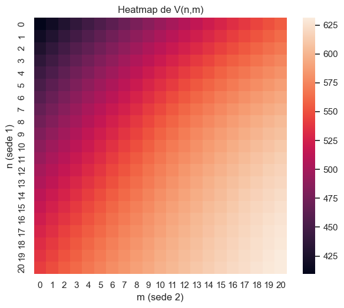

# Jack’s Car Rental — Policy Iteration with Dynamic Programming

This project was developed as part of my **Artificial Intelligence course** at *Tecnológico de Costa Rica (TEC)*.  
The assignment was to implement **Policy Iteration** on the classical *Jack’s Car Rental problem* (introduced in Sutton & Barto’s *Reinforcement Learning: An Introduction*).  

The work is presented as a **Jupyter Notebook**, combining mathematical formulation, Python code, and visualizations.

---

## Problem Description

Jack manages two rental locations. Each day:
- Customers arrive following a **Poisson distribution** (λ = 3 at location 1, λ = 4 at location 2).  
- Cars are returned also following a **Poisson distribution** (μ = 3 at location 1, μ = 2 at location 2).  
- Renting a car yields a reward of **$10**.  
- Up to **5 cars can be moved overnight**, each move costing **$2**.  
- Maximum capacity: **20 cars per location**.  
- Discount factor: **γ = 0.9**.  

The objective is to:
- Model the system as an MDP ⟨S, A, P, R, γ⟩.  
- Apply **Policy Iteration** (policy evaluation + policy improvement).  
- Find the optimal policy π\* and value function V\*.  
- Visualize the results as **heatmaps**.  

---

## Key Concepts

- Dynamic Programming (Policy Iteration)  
- Bellman Equations for V and Q functions  
- Poisson distributions for demand and returns  
- Transition matrices for inventory  
- NumPy vectorization for efficiency  
- Heatmaps with Matplotlib and Seaborn  

---

## How to Run

### Requirements
numpy
matplotlib
seaborn
jupyter

### Steps
1. Clone this repository:
git clone jack-car-rental-mdp
cd jack-car-rental-mdp

2. Open the notebook:
3. Run all cells to:
- Compute the value function and the optimal policy.  
- Generate heatmaps of V*(n,m) and π*(n,m).  

---

## Results

- **Value Function Heatmap (V*(n,m))** → shows the expected return for each state.  
- **Policy Heatmap (π*(n,m))** → shows how many cars to optimally move between locations.  

---

## Insights

- The optimal policy tends to move cars from location 1 → location 2, because demand is higher at location 2.  
- Movements are limited by cost and the maximum of 5 cars per night.  
- Compared to a "do nothing" policy, this strategy significantly improves expected returns.  

---

## References

- Sutton, R. S., & Barto, A. G. (2018). Reinforcement Learning: An Introduction (2nd ed.).  
- Artificial Intelligence course — Tecnológico de Costa Rica (TEC), 2025.  

---

## License

MIT License

